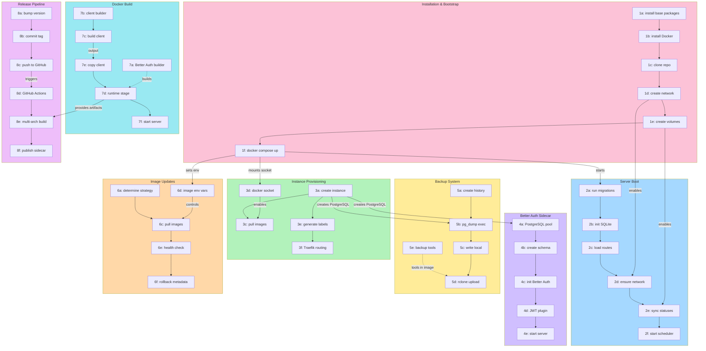

# Convexer

> Disclosure: this project has been built with heavy AI assistance. That is useful for speed, but it does not magically make the software mature, audited, or production-grade. Treat Convexer as pragmatic self-hosting software that works for its maintainer's deployment, not as a polished commercial control plane. Read the code, keep backups, and test upgrades before trusting important workloads to it.

Convexer is a self-hosted manager for running multiple Convex-based mobile backend bundles on one VPS. Each app instance can have its own Convex backend, Convex dashboard, PostgreSQL database, and Better Auth sidecar, while shared services such as Traefik, Umami, GlitchTip, backups, and push notification configuration live at the Convexer level to save server resources.

It is inspired by CapRover: point a server at a domain, open a few ports, and manage app backends from a web dashboard.



## Maturity

Current status: early self-hosted alpha.

Convexer is useful today if you are comfortable operating a VPS, Docker, DNS, and backups. It has automated checks and end-to-end tests for the main flows, and it is being used on a real server. It is still young software with sharp edges. The safest assumption is that you are the operator, not just the user.

What it can offer reliably right now:

- A repeatable Docker Compose deployment for one server
- A web UI for creating and managing multiple Convex backend instances
- Per-instance PostgreSQL containers and volumes
- Traefik label-based routing for Convexer and instance subdomains
- Manual and scheduled backups, including upload to configured remote destinations
- A guarded image-based self-update path with candidate health checks and rollback metadata
- Basic admin diagnostics for Docker, volumes, update jobs, and repair actions
- A workable development and testing loop with TypeScript builds and Playwright e2e coverage

What it does not claim to be yet:

- Not a hardened multi-tenant platform
- Not a high-availability or clustered Convex control plane
- Not a substitute for understanding Docker, DNS, PostgreSQL, and backups
- Not security-audited
- Not guaranteed to preserve data if you skip backups, remove volumes, or run destructive Docker commands
- Not a turnkey TLS/certificate-management solution in the checked-in Compose file
- Not a promise that every update will be zero-downtime for every deployment shape

If you use this for real projects, run it like infrastructure: restrict dashboard access, keep host-level backups, test restores, read release diffs, and update deliberately.

## Features

- Create, start, stop, duplicate, archive, and restore Convex instances
- Per-instance Convex backend, dashboard, PostgreSQL database, and optional Better Auth sidecar
- PostgreSQL table browsing, schema inspection, SQL query execution, import/export, backup, and restore
- Manual and scheduled local/remote backups
- Traefik-based subdomain routing through Docker labels
- Shared Umami analytics and GlitchTip error tracking containers
- Per-instance environment variable and subdomain configuration
- Per-instance health check timeout configuration
- Live CPU, memory, disk, and network metrics
- Image-based self-update flow with candidate health checks, status logs, diagnostics, and rollback references
- Push notification gateway configuration scaffold for app backends

## Server Prerequisites

Recommended target:

- Fresh Ubuntu 22.04/24.04 or Debian 12 VPS
- Root access or a sudo-capable user
- 2 GB RAM minimum, 4 GB+ recommended
- 20 GB disk minimum, more if you keep local backups
- A domain pointing to the server
- Docker Engine with Docker Compose plugin
- Git and curl

The installer can install Docker, Git, curl, and ca-certificates on Debian/Ubuntu systems.

## Ports To Open

Open these inbound ports on your VPS firewall and cloud provider firewall:

- `22/tcp`: SSH
- `80/tcp`: HTTP, Traefik entrypoint and domain routing
- `443/tcp`: HTTPS entrypoint if you add TLS/cert resolver configuration
- `4000/tcp`: Convexer dashboard direct access

For a public production setup, you usually expose `80` and `443` publicly and restrict `4000` to your IP or VPN. The checked-in Compose file exposes `4000` for convenience.

## DNS

Point your root or management domain to the server:

```text
A     example.com        -> SERVER_IP
A     *.example.com      -> SERVER_IP
```

Convexer uses subdomains for instance endpoints. For an instance named `myapp`, the default domains are:

```text
myapp.example.com
myapp-site.example.com
myapp-dash.example.com
myapp-auth.example.com
```

## Quick Install

On a fresh server, run:

```bash
curl -fsSL https://raw.githubusercontent.com/malipetek/convexer/main/install.sh | sudo bash -s -- --domain example.com --password 'change-this-password'
```

Then open:

```text
http://example.com
```

Or, while DNS is still propagating:

```text
http://SERVER_IP:4000
```

### Installer Options

```bash
curl -fsSL https://raw.githubusercontent.com/malipetek/convexer/main/install.sh | sudo bash -s -- \
  --domain example.com \
  --password 'change-this-password' \
  --dir /home/convexer \
  --repo https://github.com/malipetek/convexer.git \
  --branch main
```

Options:

- `--domain`: required unless `DOMAIN` is already set
- `--password`: optional, sets `AUTH_PASSWORD`
- `--dir`: install directory, defaults to `/home/convexer`
- `--repo`: Git repository URL, defaults to this repo
- `--branch`: Git branch, defaults to `main`
- `--no-docker-install`: fail if Docker is missing instead of installing it

Environment variable equivalents are also supported:

```bash
sudo DOMAIN=example.com AUTH_PASSWORD='change-this-password' bash install.sh
```

## Manual Install

```bash
git clone https://github.com/malipetek/convexer.git /home/convexer
cd /home/convexer

cat > .env <<'EOF'
DOMAIN=example.com
AUTH_PASSWORD=change-this-password
HOST_PROJECT_PATH=/home/convexer
GITHUB_REPO=malipetek/convexer
UPDATE_BRANCH=main
EOF

docker network create convexer-net 2>/dev/null || true
docker volume create convexer-data
docker volume create convexer-ssh
docker volume create convexer-backups
docker compose up -d --build
```

Check status:

```bash
docker compose ps
docker compose logs -f convexer
curl -s http://localhost:4000/api/version
```

## Updating

Convexer defaults to image-based updates. The dashboard starts an update job, pulls or uses the requested app and sidecar images, starts a candidate container on port `4001`, health-checks it, and then launches an external swapper container to replace the active `convexer` container. The update endpoints expose phase, progress, logs, rollback metadata, and runtime diagnostics.

The legacy git-pull updater is disabled unless `ALLOW_GIT_UPDATE=1` is set. Prefer image updates for normal use.

You can also update manually from the server:

```bash
cd /home/convexer
git pull --ff-only
docker volume create convexer-data
docker volume create convexer-ssh
docker volume create convexer-backups
docker compose up -d --build
```

Important: Convexer data lives in Docker volumes. The core volumes are explicitly named and marked external in `docker-compose.yml` so Compose does not own their lifecycle:

```text
convexer-data
convexer-ssh
convexer-backups
```

Do not run `docker compose down -v` unless you intentionally want to remove persisted data.

Before updating a server you care about, back up `convexer-data` and at least one representative instance PostgreSQL volume, then test that the backup can be restored.

## Backups

Convexer stores its own SQLite database at:

```text
/app/server/data/convexer.db
```

Inside Docker, this path is backed by the `convexer-data` volume.

Before major updates or migrations, make a host-side backup:

```bash
docker run --rm -v convexer-data:/data -v "$PWD:/backup" alpine \
  sh -lc 'tar czf /backup/convexer-data-backup-$(date +%Y%m%d-%H%M%S).tgz -C /data .'
```

Instance PostgreSQL data is stored in per-instance Docker volumes, for example:

```text
convexer-postgres-myapp
```

## Push Notifications

Convexer treats push notifications as per-app backend infrastructure, not as Convexer status alerts. Each instance should own its app users, devices, subscriptions, and notification preferences in its own Convex/PostgreSQL data model. Convexer stores the provider configuration and gives you a test sender plus delivery logs.

Current shape:

```text
Mobile app
  -> registers device token / UnifiedPush endpoint with its Convex instance

Convex instance
  -> stores device subscriptions
  -> decides when to notify
  -> calls provider using the configured push gateway settings

Convexer
  -> stores per-instance provider configuration
  -> sends test notifications
  -> records delivery attempts
```

What can be self-hosted:

- UnifiedPush can be self-hosted for FOSS Android clients, commonly with ntfy as the distributor.
- Webhook delivery can point at any self-hosted or external bridge.
- iOS native push requires Apple APNs.
- Mainstream Android through Google Play services normally uses FCM.
- Web/PWA push uses browser push infrastructure even when you self-host your application.

Recommended rollout:

1. Use `unifiedpush` for self-hosted/FOSS Android experiments.
2. Use `webhook` while developing bridges or testing a custom push service.
3. Add APNs and FCM credentials per instance when targeting production iOS and mainstream Android apps.

### UnifiedPush Config

The current `unifiedpush` provider supports either direct endpoint delivery:

```json
{
  "endpoints": [
    "https://ntfy.example.com/up/DEVICE_ENDPOINT"
  ],
  "auth_token": ""
}
```

Or topic-style delivery:

```json
{
  "base_url": "https://ntfy.example.com",
  "topic": "myapp-devices",
  "auth_token": ""
}
```

Direct endpoints are the better long-term model for real apps because each device subscription can have its own endpoint. Topic-style delivery is useful for smoke tests and early prototypes.

### Webhook Config

Use `webhook` when you have a custom bridge or want to forward notifications to another internal service:

```json
{
  "url": "https://push-bridge.example.com/send",
  "method": "POST",
  "auth_token": "optional-bearer-token",
  "headers": {}
}
```

### Logs

Push delivery attempts are shown in each instance's `Push` tab. If you later add a dedicated push service container such as `convexer-ntfy`, `ntfy`, or `gotify`, the global `Settings -> Utilities` tab can discover it and display container logs.

## Environment Variables

- `DOMAIN`: public hostname for Convexer and generated instance subdomains
- `AUTH_PASSWORD`: optional dashboard password
- `HOST_PROJECT_PATH`: absolute host path to the repo, required only for legacy git updates and host-data mounting
- `GITHUB_REPO`: GitHub repo slug used by version checking, for example `malipetek/convexer`
- `GITHUB_TOKEN`: optional token for private repos or higher GitHub API limits
- `UPDATE_BRANCH`: branch used by the legacy git updater, defaults to `main`
- `UPDATE_STRATEGY`: update mode, defaults to `image`
- `ALLOW_GIT_UPDATE`: set to `1` only if you intentionally want to enable the legacy git-pull updater
- `CONVEXER_IMAGE`: image base used by image updates, defaults to `convexer-convexer`
- `BETTERAUTH_IMAGE`: Better Auth sidecar image used by managed instances and image updates
- `TUNNEL_DOMAIN`: optional legacy Cloudflare tunnel domain
- `TUNNEL_CONFIG_PATH`: optional legacy cloudflared config path

## Architecture

```text
convexer
  React dashboard + Express API
  SQLite metadata database
  Docker socket access for managing sibling containers

traefik
  Docker-label based routing for Convexer and app instances

per app instance
  Convex backend
  Convex dashboard
  PostgreSQL
  Better Auth sidecar

shared services
  Umami
  GlitchTip
  backup storage
  push notification gateway configuration
```

## Development

This repo currently has both npm and pnpm artifacts because production Docker builds use npm, while the local development environment may prefer pnpm.

```bash
pnpm install
pnpm dev
pnpm build
```

Server only:

```bash
pnpm -C server dev
```

Client only:

```bash
pnpm -C client dev
```

## Notes

- The current Traefik configuration defines HTTP and HTTPS entrypoints, but does not yet configure Let's Encrypt certificates in the checked-in Compose file.
- The Convexer container mounts `/var/run/docker.sock`, so anyone with dashboard access can indirectly control Docker on the host. Use a strong `AUTH_PASSWORD` and restrict access.
- The core Docker volumes are external. Create `convexer-data`, `convexer-ssh`, and `convexer-backups` before manual `docker compose up` runs on a fresh host.
- Keep backups of `convexer-data` and instance PostgreSQL volumes before updating.
